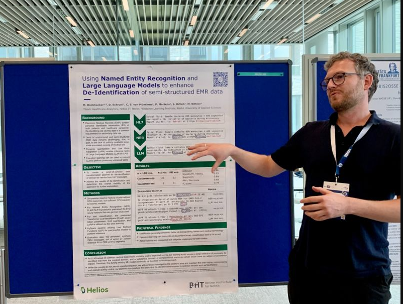

Today I presented a poster at the [GMDS 2023](https://www.gmds2023.de/) congress in Heilbronn Germany. The poster was about using Named Entity Recognition (NER) and Language Models (LLMs) to enhance the de-identification of semi-structured Electronic Medical Record (EMR) data.

In essence we used open-source LLMs to augment our de-identification pippeline for semi-structured EMR data. The LLMs were used to identify entities that were not covered by the NER model we used.
Since all of this had to be done on-site (on-premise) and with limited resources, you can probably imagine that the results were'nt stellar. But we learned a lot and have a good idea of what to do next.

All in all this was a lot of fun!

The Abstract for the poster can be found [here](https://www.egms.de/static/en/meetings/gmds2023/23gmds114.shtml) (DOI: [10.3205/23GMDS114](https://doi.org/10.3205/23gmds114))